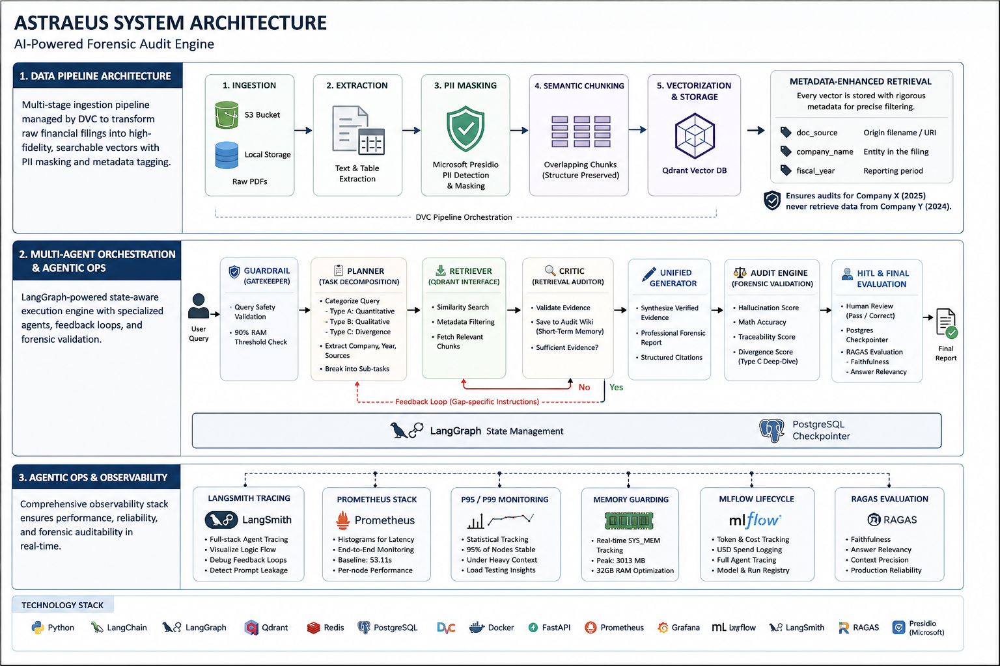
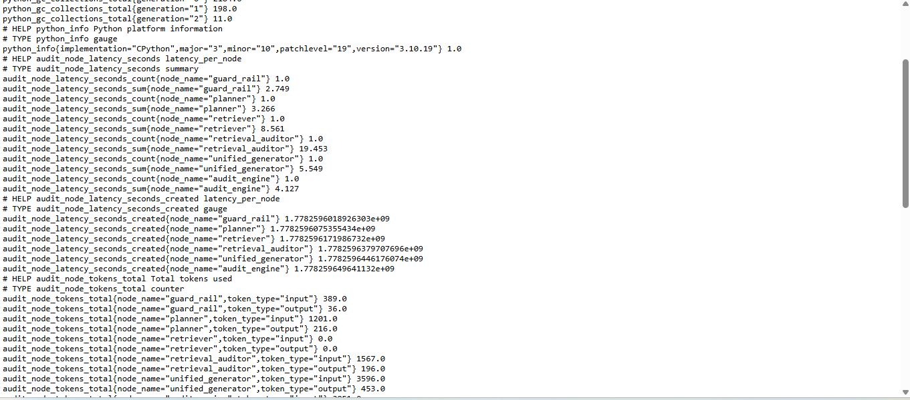
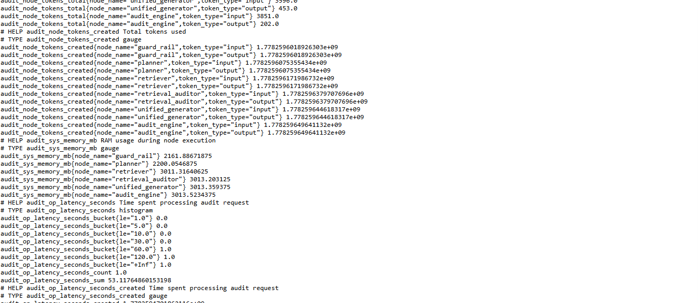

# ⚖️ Astraeus: Multi-Agent Forensic Audit & Divergence Engine

## 📘 Introduction
**Astraeus** is a high-precision orchestration platform designed to automate the forensic auditing of corporate financial reporting. By utilizing a **Lead Auditor-Critic architecture**, the system identifies factual inconsistencies between official 10K financial report and earnings transcripts.

## 🏗️ System Architecture
The engine is built on a directed graph using **LangGraph**, ensuring state-aware transitions between nodes.

<p align="center">
  
</p>


### 1. 🏗️ Data Pipeline Architecture

Astraeus utilizes a multi-stage ingestion pipeline managed by **DVC** to transform raw financial filings into high-fidelity, searchable vectors. The pipeline ensures forensic integrity through strict PII masking and granular metadata tagging.

### **The Ingestion Workflow**
1.  **Ingestion:** Raw PDFs are pulled from **S3 Buckets** or local storage.
2.  **Extraction:** Text and table extraction are performed using specialized parsers to maintain structural integrity.
3.  **Security (PII Masking):** **Microsoft Presidio** scans and masks sensitive data (names, social security numbers, or private contact info) before any data is vectorized.
4.  **Semantic Chunking:** Documents are broken into overlapping chunks to maintain context across financial sections.
5.  **Vectorization & Storage:** Chunks are embedded and stored in **Qdrant**.

### **Metadata-Enhanced Retrieval**
To ensure high-precision filtering and prevent "context leakage" between different audits, every vector is stored with a rigorous metadata schema:

*   **`doc_source`**: The origin filename or URI.
*   **`company_name`**: The specific entity identified in the filing.
*   **`fiscal_year`**: The reporting period.

> **Why Metadata Matters:** This allows the **Planner** to apply hard filters during the retrieval phase, ensuring that an audit for "Company X (2025)" never accidentally retrieves data from "Company Y (2024)," which is a critical requirement for forensic auditing.

 
### 2. Multi-Agent Orchestration & Agentic Ops
This is the core execution engine, built on **LangGraph** and monitored via a comprehensive Observability Stack.

### I. The Multi-Agent Execution Graph
Astraeus operates as a state-aware directed graph with specialized nodes and feedback loops.

*   **🛡️ Request Gatekeeper (Guardrail Node):**
    *   **Function:** Validates query safety and scope.
    *   **System Health:** Enforces a 90% RAM threshold check to ensure stability on 32GB hardware.
*   **📋 The Planner (Task Decomposition):**
    *   **Categorization:** Segregates requests into three distinct audit paths:
        *   **Type A:** Quantitative analysis.
        *   **Type B:** Qualitative thematic analysis.
        *   **Type C (Divergence Audit):** Specialized forensic path to identify discrepancies between **10-K Reports** and **Earnings Transcripts**.
    *   **Deconstruction:** Extracts Company, Year, and Document Sources, breaking queries into discrete sub-tasks.
*   **📥 The Retriever (Qdrant Interface):**
    *   **Function:** Executes high-precision similarity searches within **Qdrant** based on the Planner's sub-tasks.
    *   **Context Fetching:** Dynamically pulls relevant document chunks from the correct company and fiscal year sources.
*   **🔍 The Critic (Retrieval Auditor) & Feedback Loop:**
    *   **Validation:** Rigorously checks if retrieved documents accurately answer the Planner's specific tasks.
    *   **Audit Wiki:** Verified evidence (page numbers/citations) is saved to the **Audit Wiki** to serve as "Short-Term Memory" for follow-up queries, preventing redundant retrieval.
    *   **Self-Correction:** If evidence is insufficient, it triggers a feedback loop to the Planner with gap-specific instructions.
*   **✍️ Unified Generator:**
    *   **Synthesis:** Consolidates verified evidence from the Retrieval Auditor into a professional forensic report with structured citations.
*   **⚖️ Audit Engine (Forensic Validation):**
    *   **Quality Gate:** Performs deep validation of the report before human review.
    *   **Scoring Engine:** Assigns rigorous metrics: **Hallucination Score**, **Math Accuracy**, and **Traceability Score**.
    *   **Forensic Deep-Dive:** Specifically for **Type C** queries, it calculates the **Divergence Score** to flag management narrative inconsistencies.
*   **🧑‍💻 Human-in-the-Loop (HITL) & Final Evaluation:**
    *   **Human Checkpoint:** Persistent state via **Postgres Checkpointer** allows a human reviewer to "Pass" or "Manually Correct" the report.
    *   **RAGAS Final Evaluation:** Once passed by the human, **RAGAS** is used for final production evaluation, calculating **Faithfulness** and **Answer Relevancy** to ensure long-term model reliability.


### 3. Agentic Ops & Observability
This is the "Senior" differentiator. The system is monitored in real-time to maintain production standards on an HP laptop (32GB RAM).

*   **LangSmith Tracing**: Full-stack Agent Tracing to visualize the logic flow, identify prompt-leakage, and debug the state-aware   
                           feedback loops.
*   **📊 Prometheus Stack:** Uses **Histograms** to capture end-to-end latency (**Baseline: 53.11s**) and per-node performance.
*   **📈 P95/P99 Monitoring:** Statistical tracking ensures 95% of audit nodes remain stable under heavy context loads.
*   **🧠 Memory Guarding:** Real-time **SYS_MEM** tracking to manage high-precision tasks (Peak: **3013 MB**).
*   **🧪 MLflow Lifecycle:** Automated logging of token consumption, USD costs, and full agent tracing for forensic auditability.

---

## 🛠️ Tech Stack & Infrastructure

Astraeus is built on a production-grade stack designed for high-precision forensic auditing and real-time observability.

### **Core Orchestration & API**
*   **Language:** Python 3.11+
*   **Framework:** **FastAPI** (Async high-performance API)
*   **Orchestration:** **LangGraph** (State-aware Multi-Agent System)


### **Intelligence & Evaluation**
*   **LLMs:** **GPT-4o** (Lead Auditor/Generator) & **GPT-4o-mini** (Guardrails/Retriever)
*   **Semantic Cache:** **ChromaDB** (Stores previous query results for semantic comparison, reducing redundant LLM calls and latency)
*   **Evaluation:** **RAGAS** (Post-audit Faithfulness and Relevancy metrics)
*   **Vector Engine:** **Qdrant** (High-recall similarity search for SEC filings)

### **Agentic Ops & Observability**
*   **Experiment Tracking:** **MLflow** (Trace auditing, token cost tracking, and versioning)
*   **LangSmith Tracing**: Full-stack Agent Tracing to visualize the logic flow, identify prompt-leakage, and debug the state-aware   
                           feedback loops.
*   **Real-time Metrics:** **Prometheus** (Latency histograms and P95/P99 distribution)
*   **State Persistence:** **Postgres Checkpointer** (Human-in-the-Loop state management)
*   **Containerization:** **Docker Compose** (Standardized deployment environment)

### **Security & Forensic Integrity**
*   **PII Masking:** **Microsoft Presidio** (Anonymizing sensitive data before ingestion)
*   **Quality Gates:** Custom Hallucination, Math, and Divergence Filters (Forensic scoring engine)

### **Cloud & DevOps (Deployment Architecture)**
*   **Cloud Infrastructure:** **AWS (EC2)** (Scaled compute instances for high-concurrency auditing)
*   **CI/CD Pipeline:** **GitHub Actions** (Automated testing, linting, and container deployment)
*   **Unit Testing:** **Every push triggers tests to validate node logic and API endpoints.
*   **Regression Testing:** **Ensures that prompt updates or model changes (e.g., GPT-4o to mini) do not degrade the accuracy of Type C Divergence scores.

### **Continuous Monitoring**:
*  **Latency Alerts:** Automated Prometheus alerts if any audit node exceeds the P95 threshold.
*  **Resource Tracking:** Real-time monitoring of EC2 CPU and RAM to prevent system crashes.
*  **Forensic Integrity & SecuritY:**
            * PII Masking: Microsoft Presidio automatically anonymizes sensitive data within SEC filings before they are ingested into Qdrant.

           * Forensic Quality Gates: Audit engine for Hallucination, Math, and Traceability scoring to ensure the final report is legally and financially sound.

           * Secure State Management: Uses environment variables and AWS Secrets Manager to handle API keys and Database credentials.


---

## 📑 Technical Report: Agentic Ops & Performance Analysis

### 1. Observability & Real-Time Monitoring
Astraeus treats observability as a mechanical necessity for reliability on consumer hardware (32GB RAM).

### **Statistical Latency & P99 Strategy**
*   **Total Operation Latency:** Tracked via `audit_op_latency_seconds` histograms. 
*   **P99 & P95 Monitoring:** We prioritize **P99** to identify the absolute worst-case performance scenarios. 
*   **Latency Alerts:** Automated **Prometheus Alerts** are configured to trigger if the P99 latency exceeds **60s**, ensuring forensic audits remain within acceptable time-bounds.

### **Resource Guarding**
*   **RAM Management:** Peak memory consumption is strictly capped at **3013.52 MB**.
*   **Health Gate:** The Guardrail node utilizes `audit_sys_memory_mb` metrics to prevent process-swapping or OOM (Out of Memory) errors during high-concurrency audits.

### 2. Forensic Evaluation & Accuracy (RAGAS)
Post-human verification, Astraeus utilizes the **RAGAS** framework to evaluate the long-term reliability of the Lead Auditor-Critic loop.

*   **Faithfulness Score (~88%):** Measures how well the final report is grounded in the retrieved SEC filings, ensuring zero fabrication of financial data.
*   **Answer Relevancy (~75%):** Evaluates how directly the evidence in audit report addresses the initial query. Optimization is ongoing to improve precision in sepcifically complex Type C (Divergence) audits.

### 3. Node Performance Analysis (Benchmark: 53.11s)

| Node | Latency (s) | Token Load (Input) | Role |
| :--- | :--- | :--- | :--- |
| **Guardrail** | 2.74 | 389 | Safety Validation |
| **Planner** | 3.26 | 1201 | Task Decomposition |
| **Retriever** | 8.56 | 0 | Vector Search |
| **Retrieval Auditor** | 19.45 | 1567 | **Critical Bottleneck** |
| **Unified Gen** | 5.54 | 3596 | Report Synthesis |
| **Audit Engine** | 4.12 | 3851 | Integrity Scoring |


| Prometheus Reports |






### 4. Engineering Impact: The Audit Wiki
The **Retrieval Auditor** consumes **36% of total latency**. To mitigate this for follow-up queries, verified evidence is cached in the **Audit Wiki**. This allows the **Planner** to skip the Retriever and Auditor steps entirely if a query is semantically similar to a previous audit, potentially reducing latency by up to **28s**.

----

## 🚀 Critical Engineering Challenges & Optimizations

Building a production-grade forensic engine on consumer hardware (32GB RAM) required solving high-stakes bottlenecks in latency and state management. Below are the architectural optimizations implemented to achieve a **~85% reduction in total audit time** and **100% state-aware accuracy**.

### **1. The Latency Bottleneck: From 4 Minutes to 19 Seconds**
*   **The Challenge:** Initially, the **Retrieval Auditor** suffered from extreme latency (~4 minutes) due to processing "noisy" or irrelevant context retrieved from the vector store.
*   **The Solution:**
    * Implemented a **Pre-Filtering Layer** for retrieved evidence. By performing a relevance check before the Auditor node, non-essential data is pruned early.
    * Implemented Query-Aware Context Compression **Context Stripping:** in the retrieval pipeline.The system now automatically prunes "fluff"—stripping away introductory sentences, legal disclaimers, and irrelevant metadata before it hits the LLM.

*   **Impact:** 
    *   Reduced Retrieval Auditor latency to **~19.45s**.
    *   By avoiding "loading the Generator" with 10+ unnecessary evidence chunks, **Generator Latency** dropped from **45s** to **5.5s**.
    *   Significant reduction in token consumption and context-window pressure.

### **2. Eliminating Follow-up Hallucinations via "Audit Wiki"**
*   **The Challenge:** The Planner was initially "stateless," creating redundant retrieval tasks for follow-up queries even if the answer existed in previous audit turns. This caused wasted compute and hallucinated redundancy.
*   **The Solution:** Developed the **Audit Wiki**—a persistent short-term memory store—complemented by a **Purifier Prompt**.
    *   **Verified Evidence:** Saves the page number, source, and a "Mini Evidence Summary" for every verified task.
    *   **Purifier Node:** Before the Planner acts, this node cross-references the new query against the Wiki to mark tasks as "Already Verified" or "Requires Retrieval."
*   **Impact:** For follow-up queries, the system skips redundant retrieval(if audit wiki has evidence to answer query/task) and auditor nodes entirely, ensuring 100% consistency and near-instant response times.

### **3. Context Window & Token Optimization**
*   **The Challenge:** Forensic reports (Type C) require dense comparison between 10-Ks and transcripts. Feeding raw chunks to the Generator caused context-window overflows and high costs.
*   **The Solution:** The Retrieval Auditor now synthesizes and passes only **"Filtered contexts"** to the Generator.
*   **Impact:** Keeps the **Unified Generator** within optimal limits (avg. 3,596 input tokens), maintaining high performance while remaining hardware-safe.


### **📈 Performance Transformation**

| Metric | Pre-Optimization | Post-Optimization | Improvement |
| :--- | :--- | :--- | :--- |
| **Retrieval Auditor Latency** | 240s | **19.45s** | **91.8%** |
| **Generator Latency** | 45s | **5.54s** | **87.7%** |
| **Follow-up Reliability** | Low (Redundant) | **High (Wiki-Aware)** | **N/A** |
| **Total Audit Time** | ~5-6 Minutes | **53.11s** | **~85%** |


---
## 🏗️ Current Optimization Sprint: 

To scale **AESTRAUS** to 500+ documents while maintaining **99%+ precision** over complex, multi-turn audits, the following architectural shifts are in development:

### 1. Relational State Management (Solving State Complexity)
*   **Problem:** As an audit progresses through 50+ follow-up queries, the **Graph State** becomes a "context dump," leading to reasoning decay and "Signal-to-Noise" failure.
*   **Architectural Change:** Transitioning from a flat list to a **Structured Relational State**.
*   **Logic:** Categorizing the Audit Wiki into distinct schemas:
    *   `verified_metrics`: Hard financial data (Revenue, EBITDA).
    *   `management_narratives`: Qualitative claims from transcripts.
    *   `temporal_history`: Audit trails across different fiscal years.
*   **Outcome:** Enables **"Surgical Context Injection,"** allowing the Planner to pull only the specific data category required for a sub-task, minimizing hallucination risk.

### 2. Active Context Pruning (Solving "Lost in the Middle")
*   **Problem:** Even with 1M+ token windows, LLM performance degrades at the center of a dense prompt. Over-stuffing history causes the agent to miss critical audit evidence.
*   **Architectural Change:** Moving from "Infinite Context" to **Dynamic Pruning**.
*   **Logic:** Implementing a **Knowledge Decay** and **Summary Compression** layer. Instead of passing raw historical data, the system passes a **Recursive Summary of Evidence**.
*   **Outcome:** Keeps the Planner’s focus sharp on the **"Delta"**—the specific gap between existing verified knowledge and the current audit objective.

### 3. Persistent Audit Knowledge Base (Permanent Asset Storage)
*   **Problem:** Currently, the Audit Wiki is volatile (session-based). Once the application stops, the digital "Work Paper" vanishes.
*   **Architectural Change:** Implementing a **Vector-Relational Database** for the persistent Audit Wiki.
*   **Logic:**
    *   New queries perform a **Semantic Search** against the entire history of verified audit facts before triggering the Planner.
    *   **Zero-Retriever Logic:** If the answer exists in the persistent Wiki, the system bypasses the Retrieval Node entirely.
*   **Outcome:** Massive reduction in token costs and latency by treating the Audit Wiki as a **Permanent Knowledge Asset** rather than a temporary buffer.

---
# How to run

### 1. Configure Environment Variables

   Create a `.env` file in the root directory and populate it with your specific service credentials.

    * ```env
    # Intelligence

    OPENAI_API_KEY="YOUR_KEY"

    # Agentic Tracing (LangSmith)

    LANGCHAIN_TRACING_V2="true"

    LANGCHAIN_ENDPOINT="[https://api.smith.langchain.com](https://api.smith.langchain.com)"

    LANGCHAIN_PROJECT="your_project"

    LANGCHAIN_API_KEY="your_api"

    # Database & State (PostgreSQL)

    POSTGRES_USER="YOUR_USER"

    POSTGRES_PASSWORD="YOUR_PASSWORD"

    POSTGRES_DB="YOUR_DATABASE"

    DB_URI="YOUR_DB_URI"

    # Semantic Cache & Storage

    CHROMA_HOST="localhost"

    CHROMA_PORT=8000

    DATA_DIR="data/"

    # Experiment Tracking (MLflow)

    MLFLOW_TRACKING_URI="YOUR_MLFLOW_TRACKING_URI"


**Note: Set up mlflow,langchain,prometheus,qdrant,llm api keys(gpt-40 and gpt-4o-mini),chroma and postgres checkpoints using your own credentials. Set up DOCKER COMPOSE.YML using own credentials**


#### 2. Critical Configuration

**NOTE- IN PORMETHEUS.YML MAKE SURE YOU ARE SETTING YOUR OWN LOCAL HOST/FAST API AS TARGET**

    - ```yaml
    - targets: ["YOUR_HOST:8001"]  # Points to your FastAPI


#### 3. Clone the repository

    **git clone <repo_url>**
    **cd Astraeus**


#### 4. Install Dependencies

**pip install -r requirements.txt**


#### 5. Start Infrastructure services:

**Install Docker Desktop and start the required services:**

    * ```bash
    docker compose up -d

#### 6. Run the Data Pipeline :
   * First run data pipeline using dvc repro (data extraction to chunking and saving in qdrant)


   * This will automatically save the generated vectors into your Qdrant instance.


#### 7. Run main application to test:
  **Option A**: 
  python main.py

  **Option B**:
  uvicorn app:app --host 0.0.0.0 --port 8001 --loop asyncio --reload


#### 8. Set of queries to test:
**Type A**
*  Calculate Nike's Gross Margin for 2022 .
   
   Follow up query: Extract the Gross Margin for Fiscal 2021 and compare it against the 2022 figure.
*  Management claims the 120 bps increase in Gross Margin was due to 'NIKE Direct' and 'full-price sales.' Cross-reference this with the 'Inventory' levels in the 10-K.
*  Calculate the percentage change in Nike's 'Cash and Equivalents' between FY2019 and FY2020 to determine the liquidity buffer built during the pandemic.

**Type B**
*  Identify management's discussion on 'Nike Direct' growth and digital consumer connections during the 2020 global store shutdown period.
*  how did the 'temporary closure of nearly all Nike's stores outside of Greater China' specifically impact Nike's investment in digital capabilities and the Nike App?

    Follow up Query :Given the $10.7 billion digital sales achieved in 2022, cross-reference this with the 2022 10-K 'Operating Overhead' section. Does management attribute the 80 basis point decline in gross margin specifically to these digital investments, or were logistics and freight the primary drivers?

**Type C**
*  Analyze the divergence between Nike's management’s claim of a 'digital step-function change' in the 2020 Transcript and the reported 
     820 basis point drop in gross margin in the 2020 10-K
*  Nike's Management discusses 'digital acceleration' in the 2020 transcript. Cross-reference the digital sales growth claims with the 
      actual 'NIKE Direct' revenue line in the 10-K.
*  Given the 49% digital growth identified in 2020, cross-reference the 2020 10-K 'Gross Margin' explanation with management's 'digital 
     acceleration' narrative. Does the 10-K attribute the 130 basis point margin contraction to higher digital fulfillment costs, and did management mention this 'profitability trade-off' in the transcript?

     FOLLOW UP QUERY:Compare the Nike's 2020 claim that digital is 'financially accretive' with the 2021 10-K 'Selling and Administrative Expense' section. Identify if the increase in demand creation and operating overhead suggests that while digital is 'accretive' on a gross level, it is actually dilutive to operating income due to higher marketing and tech spend
